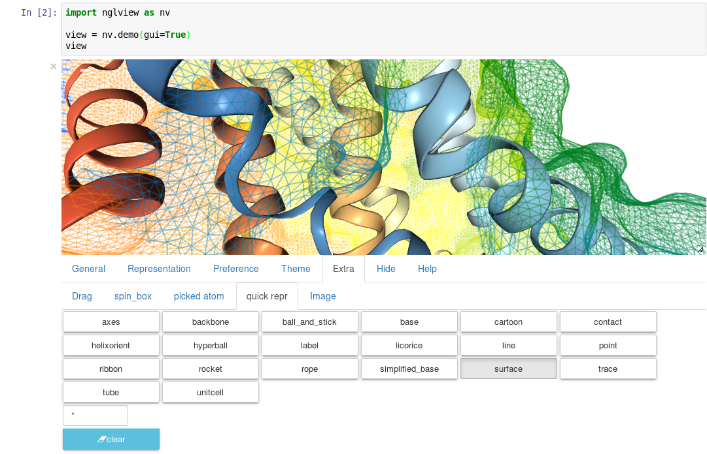

[Installation](#installation) | [Example](#example) | [Usage](#usage) | [Command line](#command-line) | [API doc](#api-doc) | [Interface classes](doc/interface_classes.md) | [Website](#website) | [GUI](#show-gui) | [Acknowledgment](#acknowledgment)

[](http://mybinder.org/repo/hainm/nglview-notebooks)
[](https://zenodo.org/badge/latestdoi/11846/arose/nglview)
[](https://travis-ci.org/arose/nglview)
[](http://bioconda.github.io)

An [IPython/Jupyter](http://jupyter.org/) widget to interactively view molecular structures and trajectories. Utilizes the embeddable [NGL Viewer](https://github.com/arose/ngl) for rendering. Support for showing data from the file-system, [RCSB PDB](http:www.rcsb.org), [simpletraj](https://github.com/arose/simpletraj) and from objects of analysis libraries [mdtraj](http://mdtraj.org/), [pytraj](http://amber-md.github.io/pytraj/latest/index.html), [mdanalysis](http://www.mdanalysis.org/), [ParmEd](http://parmed.github.io/ParmEd/), [rdkit](https://github.com/rdkit/rdkit).

Should work with Python 2 and 3. If you experience problems, please file an [issue](https://github.com/arose/nglview/issues).


Table of contents
=================

* [Installation](#installation)
* [Example](#example)
* [Usage](#usage)
* [Command line](#command-line)
* [API doc](#api-doc)
* [Interface classes](doc/interface_classes.md)
* [Changelog](CHANGELOG.md)
* [FAQ](#faq)
* [Website](#website)
* [Acknowledgment](#acknowledgment)
* [License](#license)


Installation
============

Released version
----------------

- Available on `bioconda` channel

    `conda install nglview -c bioconda`

- Available on [PyPI](https://pypi.python.org/pypi/nglview/)

    `pip install nglview`

Development version
-------------------

Requirement: `ipywidgets >= 5.1`, `notebook >= 4.2`

The development version can be installed directly from github:

```bash
    git clone https://github.com/arose/nglview
    cd nglview
    python setup.py install
    
    # if you edit files in ./js folder, make sure to add --npm flag (require npm)
    python setup.py install --npm

    # probably need to activate widgetsnbextension
    # python -m ipykernel install --user
    # jupyter nbextension enable --py --user widgetsnbextension
    # jupyter nbextension enable --py --user nglview
    
    # tested with ipywidgets 5.2.2, notebook 4.2.1
```

Example
=======

- Notebooks: please see our [Jupyter notebook examples](examples/README.md)
- Simple demo for trajectory (take time to load): [biomembrane](http://amber-md.github.io/pytraj/latest/ngl_player.html)

Usage
=====

Open a notebook

    jupyter notebook

and issue

```Python
import nglview
view = nglview.show_pdbid("3pqr")  # load "3pqr" from RCSB PDB and display viewer widget
view
```

A number of convenience functions are available to quickly display data from
the file-system, [RCSB PDB](http:www.rcsb.org), [simpletraj](https://github.com/arose/simpletraj) and from objects of analysis libraries [mdtraj](http://mdtraj.org/), [pytraj](http://amber-md.github.io/pytraj/latest/index.html), [mdanalysis](http://www.mdanalysis.org/), [ParmEd](http://parmed.github.io/ParmEd/), [rdkit](https://github.com/rdkit/rdkit).

| Function                                 | Description                                           |
|------------------------------------------|-------------------------------------------------------|
| `show_structure_file(path)`              | Shows structure (pdb, gro, mol2, sdf) in `path`       |
| `show_pdbid(pdbid)`                      | Shows `pdbid` fetched from RCSB PDB                   |
| `show_simpletraj(struc_path, traj_path)` | Shows structure & trajectory loaded with `simpletraj` |
| `show_mdtraj(traj)`                      | Shows `MDTraj` trajectory `traj`                      |
| `show_pytraj(traj)`                      | Shows `PyTraj` trajectory `traj`                      |
| `show_parmed(structure)`                 | Shows `ParmEd` structure
| `show_mdanalysis(univ)`                  | Shows `MDAnalysis` Universe or AtomGroup `univ`       |
| `show_rdkit(mol)`                        | Shows `rdkit` rdkit.Chem.rdchem.Mol                   |


API
===

Representations
---------------

```python
view.add_representation(repr_type='cartoon', selection='protein')

# or shorter
view.add_cartoon(selection="protein")
view.add_surface(selection="protein", opacity=0.3)

# specify color
view.add_cartoon(selection="protein", color='blue')

# specify residue
view.add_licorice('ALA, GLU')

# clear representations
view.clear_representations()

# update parameters for ALL cartoons of component 0 (default)
view.update_cartoon(opacity=0.4, component=0)

# remove ALL cartoons of component 0 (default)
view.remove_cartoon(opacity=0.4, component=0)
```

And many more, please check [NGL website](http://arose.github.io/ngl/api//tutorial-selection-language.html)

Representations can also be changed by overwriting the `representations` property
of the widget instance `view`. The available `type` and `params` are described
in the NGL Viewer [documentation](http://arose.github.io/ngl/api/dev/tutorial-molecular-representations.html).

```Python
view.representations = [
    {"type": "cartoon", "params": {
        "sele": "protein", "color": "residueindex"
    }},
    {"type": "ball+stick", "params": {
        "sele": "hetero"
    }}
]
```

The widget constructor also accepts a `representation` argument:

```Python
initial_repr = [
    {"type": "cartoon", "params": {
        "sele": "protein", "color": "sstruc"
    }}
]

view = nglview.NGLWidget(struc, representation=initial_repr)
view
```


Properties
----------

```Python
# set the frame number
view.frame = 100
```

```Python
# parameters for the NGL stage object
view.parameters = {
    # "percentages, "dist" is distance too camera in Angstrom
    "clipNear": 0, "clipFar": 100, "clipDist": 10,
    # percentages, start of fog and where on full effect
    "fogNear": 0, "fogFar": 100,
    # background color
    "backgroundColor": "black",
}

# note: NGLView accepts both origin camel NGL keywords (e.g. "clipNear")
# and snake keywords (e.g "clip_near")
```

```python
# parameters to control the `delay` between snapshots
# change `step` to play forward (positive value) or backward (negative value)
# note: experimental code
view.player.parameters = dict(delay=0.04, step=-1)
```

```python
# update camera type
view.camera = 'orthographic'
```

```python
# change background color
view.background = 'black'
```
Trajectory
----------

```python
# adding new trajectory
view.add_trajectory(traj)
# traj could be a `pytraj.Trajectory`, `mdtraj.Trajectory`, `MDAnalysis.Universe`, `parmed.Structure`
# or derived class of `nglview.Trajectory`

# change representation
view.trajectory_0.add_cartoon(...) # equal to view.add_cartoon(component=0)
view.trajectory_1.add_licorice(...) # equal to view.add_licorice(component=1)
```

Add extra component
-------------------

```python
# Density volumes (MRC/MAP/CCP4, DX/DXBIN, CUBE)
# Or adding derived class of `nglview.Structure`
view.add_component('my.ccp4')

# add component from url
view.add_component('rcsb://1tsu.pdb')
# NOTE: Trajectory is a special case of component.
```

Display more than two widgets
-----------------------------

```python
# 1st cell
import ipywidgets
vbox = ipywidgets.VBox([view1, view2])
vbox # display

# 2nd cell
view1.sync_view()
view2.sync_view()
```

Show GUI
--------

Notes: Unstable feature. [See also](https://github.com/arose/nglview/blob/master/examples/README.md#unstable-features)



API doc
=======
- [Latest version](http://arose.github.io/nglview/latest/api.html)
- [Development version](http://arose.github.io/nglview/dev/api.html)

Command line
============

```bash
# Require installing pytraj (PR for other backends is welcome)

# open notebook, load `my.pdb` to pytraj's trajectory then display `view`
nglview my.pdb

# load density data
nglview my.ccp4

# open notebook, create trajectory with given topology `my.parm7` and trajecotry file `traj.nc`,
# then display `view`
nglview my.parm7 -c traj.nc

# load all trajectories with filename ending with 'nc'
# make sure to use quote " "
nglview my.parm7 -c "*.nc"

# open notebook, copy content from `myscript.py` then execute it
nglview myscript.py

# open notebook and execute 1st cell
nglview mynotebook.ipynb

# create a remote notebook
# just follow its instruction
nglview my.pdb --remote
nglview my.parm7 -c traj.nc --remote
nglview mynotebook.ipynb --remote

# demo (don't need pytraj)
nglview demo

# disable autorun the 1st cell of the notebook
nglview my.pdb --disable-autorun

# specify web browser
nglview my.pdb --browser=google-chrome
```

FAQ
===

[Q&A](https://github.com/arose/nglview/wiki/Q&A)

Website
=======

- http://arose.github.io/nglview/latest
- http://arose.github.io/nglview/dev

Projects using NGLView
======================

(Feel free to make a PR to add/remove your project here)

- [AMBER](http://ambermd.org/) -  A package of programs for molecular dynamics simulations of proteins and nucleic acids
- [mbuild](https://github.com/iModels/mbuild) - A hierarchical, component based molecule builder
- [deepchem](https://github.com/deepchem/deepchem) - Deep-learning models for Drug Discovery and Quantum Chemistry
- [pychimera](https://github.com/insilichem/pychimera) - Use UCSF Chimera Python API in a standard interpreter
- [htmd](https://github.com/Acellera/htmd) - High throughput molecular dynamics simulations

Acknowledgment
==============

- [dunovank/jupyter-themes](https://github.com/dunovank/jupyter-themes): for `oceans16` theme

License
=======

Generally MIT, see the LICENSE file for details.

[](https://coveralls.io/github/arose/nglview)
