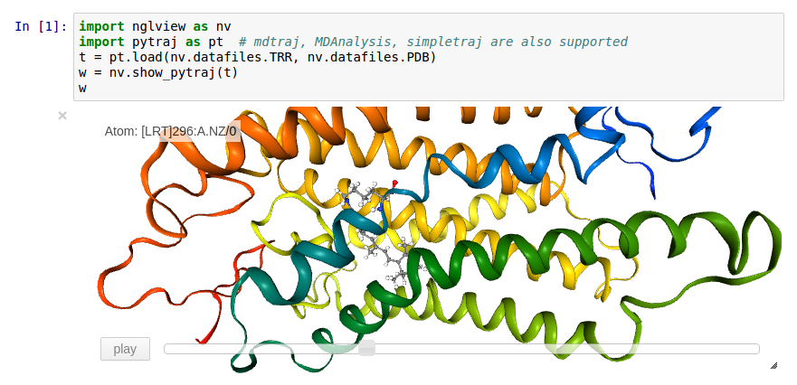

An [IPython/Jupyter](http://jupyter.org/) widget to interactively view molecular structures and trajectories. Utilizes the embeddable [NGL Viewer](https://github.com/arose/ngl) for rendering. Support for showing data from the file-system, [RCSB PDB](http:www.rcsb.org), [simpletraj](https://github.com/arose/simpletraj) and from objects of analysis libraries [mdtraj](http://mdtraj.org/), [pytraj](http://amber-md.github.io/pytraj/latest/index.html), [mdanalysis](http://www.mdanalysis.org/).

Work in progress but usable. Please contact us if you want to take part. Should work with Python 2 and 3. If you experience problems, please file an [issue](https://github.com/arose/nglview/issues).


Table of contents
=================

* [Installation](#installation)
* [Usage](#Usage)
* [Interface classes](#Interface classes)
* [Changelog](#changelog)
* [License](#license)


Installation
============

From PyPI:

    pip install nglview


From Conda

    conda install -c omnia nglview


Usage
=====

Open a notebook

    ipython notebook

and issue

```Python
import nglview
show_pdbid("3pqr")  # load "3pqr" from RCSB PDB and display viewer widget
```

A number of convenience functions are available to quickly display data from
the file-system, [RCSB PDB](http:www.rcsb.org), [simpletraj](https://github.com/arose/simpletraj) and from objects of analysis libraries [mdtraj](http://mdtraj.org/), [pytraj](http://amber-md.github.io/pytraj/latest/index.html), [mdanalysis](http://www.mdanalysis.org/).

| Function                                 | Description                                           |
|------------------------------------------|-------------------------------------------------------|
| `show_structure_file(path)`              | Shows structure in `path`                             |
| `show_pdbid(pdbid)`                      | Shows `pdbid` fetched from RCSB PDB                   |
| `show_simpletraj(struc_path, traj_path)` | Shows structure & trajectory loaded with `simpletraj` |
| `show_mdtraj(traj)`                      | Shows `MDTraj` trajectory `traj`                      |
| `show_pytraj(traj)`                      | Shows `PyTraj` trajectory `traj`                      |
| `show_mdanalysis(univ)`                  | Shows `MDAnalysis` Universe or AtomGroup `univ`       |


Structures
----------

The above convenience functions first create an `adaptor` that implements an [interface](#Interface classes) for communication with the IPython/Jupyter widget.

```Python
import nglview
struc = nglview.PdbIdStructure("3pqr")  # load file from RCSB PDB
w = nglview.NGLWidget(struc)            # create widget
w                                       # display widget
```


Trajectories
------------

To enable trajectory access pass a second `Trajectory` argument to the widget
constructor or supply a combined `Structure`/`Trajectory` object as the first
argument.

Seperate `Structure` and `Trajectory` objects using `FileStructure` and
`SimpletrajStructure` (requires the [`simpletraj`](https://github.com/arose/simpletraj)
package):

```Python
import nglview
struc = nglview.FileStructure("mystruc.pdb")
traj = nglview.SimpletrajStructure("mytraj.xtc")
nglview.NGLWidget(struc, traj)
```

Combined `Structure`/`Trajectory` object utilizing `MDTrajTrajectory` which
wraps a trajectory loaded with [MDTraj](http://mdtraj.org/):

```Python
import nglview
import mdtraj
traj = mdtraj.load("mytraj.xtc", top="mystruc.gro")
strucTraj = nglview.MDTrajTrajectory(traj)
nglview.NGLWidget(strucTraj)
```

The displayed frame can be changed by setting the `frame` property of the
widget instance `w`:

```Python
w.frame = 100  # set to frame no 100
```


Representations
---------------

Representations can be changed by overwriting the `representations` property
of the widget instance `w`. The available `type` and `params` are described
in the NGL Viewer [documentation](http://arose.github.io/ngl/doc).

```Python
w.representations = [
    {"type": "cartoon", "params": {
        "sele": "protein", "color": "residueindex"
    }},
    {"type": "ball+stick", "params": {
        "sele": "hetero"
    }}
]
```

The widget constructor also accepts a `representation` argument:

```Python
initial_repr = [
    {"type": "cartoon", "params": {
        "sele": "protein", "color": "sstruc"
    }}
]
nglview.NGLWidget(struc, representation=initial_repr)
```

Additionally representations can be added with the `add_representation` method:

```Python
w.add_representation(
    "cartoon", selection="protein", color="residueindex"
)
```


Adaptors
--------

A number of adaptor classes are available to make structures and trajectories available to the widget.
They can support either the `Structure` (S) or the `Trajectory` (T) interface as well as both combined.

| Class                        | Description                                       | Interface |
|------------------------------|---------------------------------------------------|-----------|
| `FileStructure(path)`        | Loads `path` from filesystem                      | S         |
| `PdbIdStructure(pdbid)`      | Fetches `pdbid` from RCSB PDB                     | S         |
| `SimpletrajTrajectory(path)` | Uses `simpletraj` to access trajectory at `path`  | T         |
| `MDTrajTrajectory(traj)`     | Wraps `MDTraj` trajectory `traj`                  | S and T   |
| `PyTrajTrajectory(traj)`     | Wraps `PyTraj` trajectory `traj`                  | S and T   |
| `MDAnalysisTrajectory(univ)` | Wraps `MDAnalysis` Universe or AtomGroup `univ`   | S and T   |


Multiple widgets
----------------

You can have multiple widgets per notebook cell:

```Python
from ipywidgets.widgets import Box
w1 = NGLWidget(...)
w2 = NGLWidget(...)
Box(children=(w1,w2))
```


API
===

NGLWidget
---------

### Constructor

```Python
ngl_widget = NGLWidget(structure, trajectory=None, representations=None)
```


### Properties

```Python
# set the frame number
ngl_widget.frame = 100
```

```Python
# list of representations
ngl_widget.representations = [{"type": "cartoon"}]
```

```Python
# parameters for the NGL stage object
ngl_widget.parameters = {
    # "percentages, "dist" is distance too camera in Angstrom
    "clipNear": 0, "clipFar": 100, "clipDist": 10,
    # percentages, start of fog and where on full effect
    "fogNear": 0, "fogFar": 100
}
```

### Methods

```Python
ngl_widget.add_representation("cartoon", **kwds)
```


Interface classes
=================

You can create your own adaptors simply by following the interfaces for `Structure` and `Trajectory`, which can also be combined into a single class.


Structure
---------

```Python
class MyStructure(nglview.Structure):
    ext = "pdb"  # or gro, cif, mol2, sdf
    params = {}  # loading options passed to NGL
    def get_structure_string(self):
        return "structure in the self.ext format"
```


Trajectory
----------

```Python
class MyTrajectory(nglview.Trajectory):
    def get_coordinates_list( self, index ):
        # return list of coordinates in Angstrom for the frame at the given index
        return [x1, y1, z1, x2, y2, z2]
    def get_frame_count(self):
        return 2  # return number of frames
```


Combined
--------

```Python
class MyStructureTrajectory(nglview.Structure, nglview.Trajectory):
    ext = "pdb"  # or gro, cif, mol2, sdf
    params = {}  # loading options passed to NGL
    def get_structure_string(self):
        return "structure in the self.ext format"
    def get_coordinates_list( self, index ):
        # return list of coordinates in Angstrom for the frame at the given index
        return [x1, y1, z1, x2, y2, z2]
    def get_frame_count( self ):
        return 2  # return number of frames
```


Changelog
=========

Version 0.4dev
--------------

* ADD: Convenience methods to show widget from various sources
* ADD: `PyTrajTrajectory` adaptor
* ADD: `MDAnalysisTrajectory` adaptor
* ADD: `NGLWidget.add_representation()` method
* ADD: append a "WebGL not supported message" to widget if so
* ADD: `parameters` widget property, passed to NGL stage object
* ADD: `params` property for `Structure`, dict passed to NGL
* CODE: be less noisy when importing nglview
* DOC: more usage examples, API description
* DOC: added CHANGELOG file


Version 0.3
-----------

[](http://dx.doi.org/10.5281/zenodo.44700)

* MIGRATION: `Trajectory` classes need `get_frame_count` method
* MIGRATION: removed `set_frame` method use new `frame` property
* ADD: simple trajectory player
* ADD: widget resizing support
* ADD: picking support (gui info; `picked` property)
* CODE: check for file existence in `FileStructure` and `SimpletrajTrajectory`


Version 0.2
-----------

[](http://dx.doi.org/10.5281/zenodo.44698)

* MIGRATION: changed `get_string` to `get_structure_string`
* MIGRATION: changed `get_coordinates` to `get_coordinates_list`
* DOC: usage, interface classes
* ADD: MDTrajTrajectory adaptor
* CODE: added interface classes
* CODE: suggested packages; mdtraj, simpletraj


Older versions
--------------

For changes in older versions please see the [CHANGELOG](CHANGELOG.md) file.


License
=======

Generally MIT, see the LICENSE file for details.
